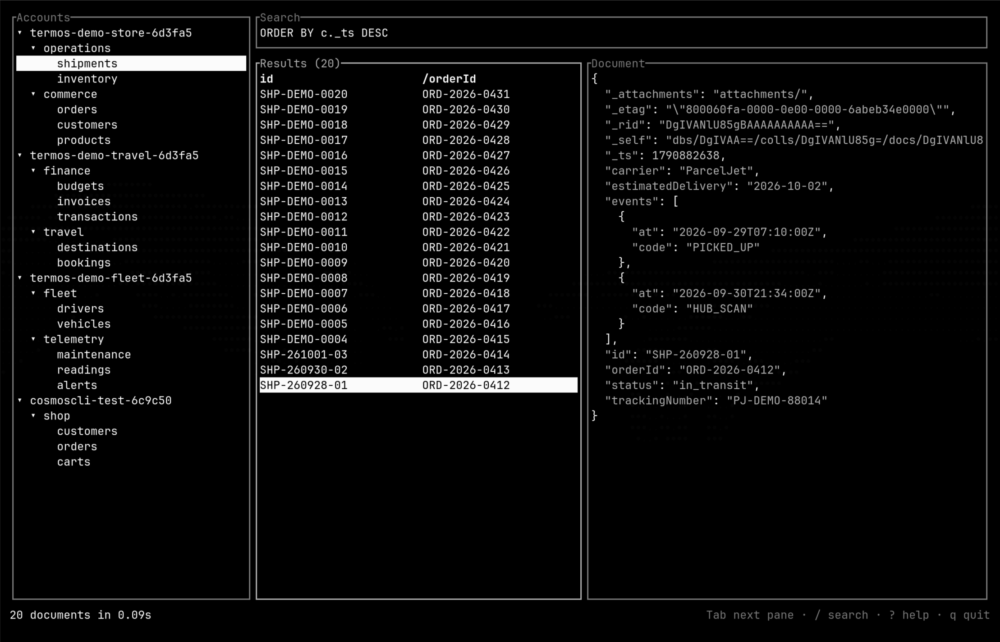
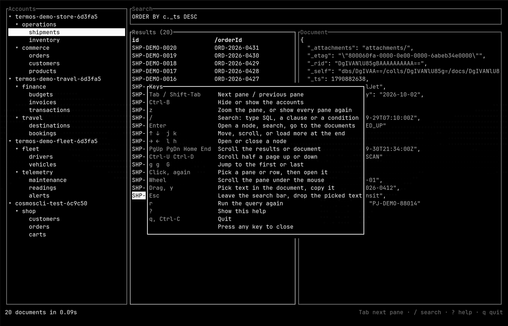
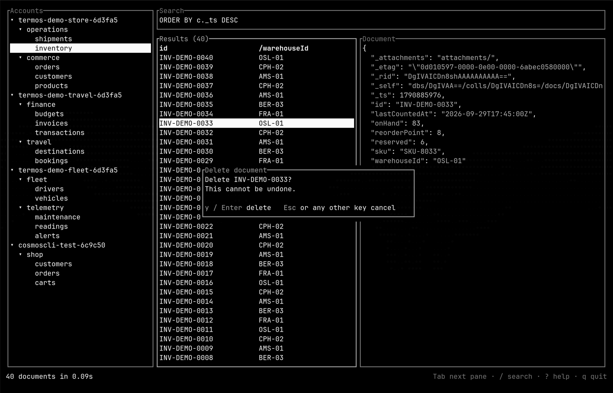
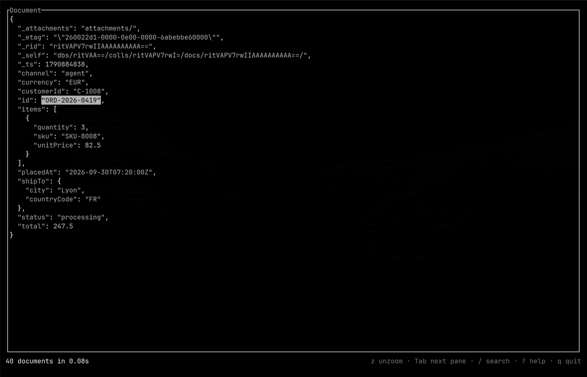
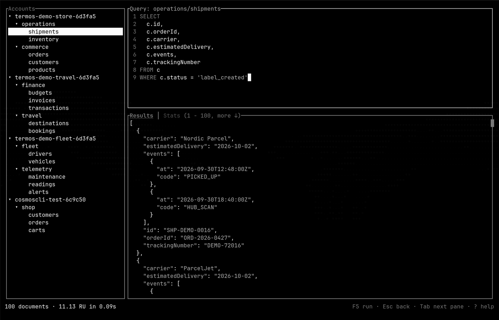
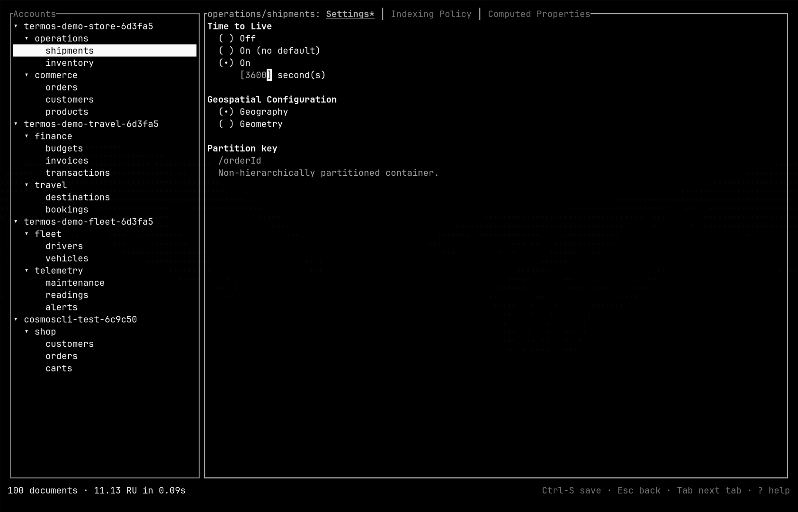

# termos

[](https://github.com/christianhelle/termos/actions/workflows/build.yml)


A terminal UI for Azure Cosmos DB (NoSQL API). It browses accounts, containers and documents in three panes, like the Data Explorer in the Azure portal.


## Requirements

- Rust 1.88 or later, when installing with `cargo`
- The [Azure CLI](https://learn.microsoft.com/cli/azure/), logged in with `az login`

## Install

### macOS/Linux

```bash
curl -fsSL https://christianhelle.com/termos/install | bash
```

This installs the latest release to `~/.local/bin`. To install somewhere else, or to pin a release:

```bash
curl -fsSL https://christianhelle.com/termos/install | INSTALL_DIR="$HOME/bin" bash
curl -fsSL https://christianhelle.com/termos/install | VERSION="<tag>" bash
```

### Windows PowerShell

```powershell
irm https://christianhelle.com/termos/install.ps1 | iex
```

This installs the latest release to `%LOCALAPPDATA%\Programs\termos`, or to `~\.local\bin` or `~\bin` if one of those already exists, and adds it to your user `PATH`. To install somewhere else, or to pin a release:

```powershell
$install = irm https://christianhelle.com/termos/install.ps1
& ([scriptblock]::Create($install)) -InstallDir "$env:USERPROFILE\bin"
& ([scriptblock]::Create($install)) -Version "<tag>"
```

### Cargo

```bash
cargo install termos
```

To build from a clone of this repository, run `cargo install --path .`.

### Release archives

Download a build from [Releases](https://github.com/christianhelle/termos/releases). Archives are available for Linux, macOS and Windows, on x64 and ARM64.

## Usage

```sh
termos [--subscription <ID>] [--auth auto|entra|key] [--key <KEY>]
termos --emulator [<ENDPOINT>] [--key <KEY>]
```

- **Accounts** (left): a tree of accounts, databases and containers. Open an account with Enter or → to load its containers. Selecting a container lists its first 100 documents, and Enter moves to them. termos starts where the last run left off, showing the same accounts, containers, documents, search and query at once while they refresh in the background. Settings and the query editor's results are not restored. The session, with the documents it showed, is saved on quit in `%LOCALAPPDATA%\termos` on Windows, `~/Library/Caches/termos` on macOS and `~/.cache/termos` on Linux. Delete the `session*.json` files there to start afresh.
- **Results** (middle): the id and partition key of each document found, 100 at a time. When the title says `more ↓`, press ↓ on the last result to load the next 100. Press `d` here to delete the selected document, then `y` or Enter in the dialog to confirm. Any other key cancels. To delete several at once, press Space on each result to mark it (or Ctrl-A to mark them all, Esc to clear the marks), then `d` deletes every marked document.
- **Document** (right): the selected document as JSON, with numbered lines, edited with Vim keys (see [Editing](#editing)). Ctrl-S saves the changes in place of the document it was read as, by its id and partition key, and only while nobody else changed it since it was read. If it was changed, or the JSON does not parse, a dialog says why and the changes stay. The title shows a `*` while there are unsaved changes, and selecting another result asks first whether to discard them. Drag the mouse over the document to pick text, then press `y` to copy it to the clipboard. Esc drops the picked text.
- **Search** (top): press `/` and type a query, then Enter. A `SELECT` statement runs as typed. Clauses like `WHERE c.status = 'open'` or `ORDER BY c._ts DESC` follow `SELECT * FROM c`. A bare condition like `c.total > 10` becomes a `WHERE` clause.

- **Query editor**: press `n` to write SQL for the selected container, like the Data Explorer's New SQL Query. The editor replaces the search bar, results and document. It starts with the latest query, colours the SQL and numbers its lines, and is edited with Vim keys (see [Editing](#editing)). F5, Ctrl-R or Shift-Enter run the query as written, so Ctrl-R does not redo there. Shift-Enter only works in terminals that report it, such as kitty, WezTerm, foot, Ghostty and Warp. Ctrl-Enter and Alt-Enter run it too. Below the editor, the output shows the results as one JSON array, 100 at a time, and ↓ at the end loads more. `s` switches to the query stats: the request charge, round trips and the metrics Cosmos DB reports for the query. `y` copies the results, `w` saves them to a JSON file and Ctrl-S saves the query. The editor keeps its results apart from the results and document, so a query that picks a few fields leaves them as they were. Selecting another container in the tree runs the next query there, and its documents are listed when you go back to browsing. Esc in normal mode leaves the editor for the output, and Esc or `n` there goes back to browsing, keeping the query for next time. A query that fails shows why in a dialog. The Azure Cosmos DB SDK for Rust cannot run aggregates such as `COUNT` or `GROUP BY` across partitions yet, so those queries fail in termos while they work in the Azure portal.
- **Settings**: press `s` to edit the selected container's settings, like the Data Explorer's Settings. They replace the other panes, with three tabs that Tab and Shift-Tab move between:
  - **Settings**: time to live (Off, On with no default, or On after a number of seconds), whether spatial data is geography or geometry, and the partition key, which cannot change. ↑ and ↓ move between the settings, ← → or Space pick another choice, and digits type the seconds.
  - **Indexing Policy** and **Computed Properties**: edited as JSON with Vim keys, with numbered, coloured lines.

  A tab with unsaved changes shows a `*`. Ctrl-S saves them all. If something cannot be saved, such as JSON that does not parse, a dialog says why and where, on the tab it is on. Esc in normal mode or `s` goes back, and asks first whether to discard any changes. Selecting another container in the tree shows its settings unless there are unsaved changes.

Tab and Shift-Tab move between the accounts, results and document (the search bar is reached with `/`), Ctrl-B hides or shows the accounts to give the other panes more room, `z` zooms the focused pane to fill the screen and shows every pane again, `r` runs the query again, `?` shows every key and `q` quits.

The mouse works too. Click a pane to focus it, or a node or document to select it. Click a selected node again to open or close it, the same as Enter. The wheel scrolls the pane under the mouse. A pane with more than fits shows a scrollbar on its right border. Because termos captures the mouse, drag in the document to pick text there, or hold Shift to select text anywhere in most terminals.

### Editing

The query editor, the document and the JSON settings tabs edit text like Vim. They start in normal mode, and the status line and the pane title show the mode in colour: blue for normal, green for insert and magenta for visual. Ctrl-S goes back to normal mode as it saves. The cursor is a block in normal mode and a bar in insert mode, in terminals that can change it.

- **Insert mode**: `i` `a` `I` `A` `o` `O` start typing, and Esc goes back to normal mode.
- **Moving**: `h` `j` `k` `l` and the arrows, `w` `b` `e` by words, `0` `^` `$` within the line, `gg` `G` to the first or last line, Ctrl-D Ctrl-U by half a page, and PgUp PgDn by a page. A count before a motion repeats it, as in `3j`.
- **Changing**: `x` `X` `D` `C` `J` `r`, and the operators `d` `c` `y` with a motion (`dw`, `c$`, `y2j`), doubled for whole lines (`dd`, `cc`, `yy`), or with `iw` for the word under the cursor (`ciw`). `p` and `P` put back what was deleted or yanked, also in another editor. `u` undoes and Ctrl-R redoes.
- **Visual mode**: `v` picks characters and `V` whole lines, then `y` `d` `x` or `c` act on them.

Yanked text is copied to the clipboard as well. In normal mode, keys Vim has no use for here still work as they do elsewhere, such as `?`, `z`, `n` and `q`.

## Screenshots

<p align="center">
  
  
</p>
<p align="center">
  
  
</p>
<p align="center">
  
  
</p>

## Authentication

Accounts, databases and containers are found through Azure Resource Manager, using your `az login` identity. Accounts come from every subscription you can access; add `--subscription <ID>` to list just one.

Documents are read through the Cosmos DB data plane. `--auth` picks how to authenticate:

| `--auth` | Behaviour |
| --- | --- |
| `auto` (default) | Try Entra ID first. If you have no Cosmos DB data plane role, fall back to the account key fetched from Resource Manager. |
| `entra` | Only use Entra ID. |
| `key` | Only use the account key fetched from Resource Manager. |

Pass `--key <KEY>` to supply an account key yourself.

## Emulator

`--emulator` browses the local [Cosmos DB emulator](https://learn.microsoft.com/azure/cosmos-db/emulator) instead of Azure, with no `az login`. It connects to `https://localhost:8081/` with the emulator's well-known key and accepts its self-signed certificate. Give another endpoint as `--emulator <ENDPOINT>`, and pass `--key <KEY>` if the emulator was started with its own key.

```sh
termos --emulator
termos --emulator http://cosmos:8081/
```

The emulator in Docker tells clients to use its address inside the container, which can't be reached from the host. Start it with that address set to `127.0.0.1`, and publish port 8081 as itself:

```sh
docker run -d -p 8081:8081 -p 10250-10255:10250-10255 \
  -e AZURE_COSMOS_EMULATOR_IP_ADDRESS_OVERRIDE=127.0.0.1 \
  mcr.microsoft.com/cosmosdb/linux/azure-cosmos-emulator:latest
```

## Development

```sh
cargo test
cargo clippy --all-targets -- -D warnings
cargo fmt --check
```

- Azure access: the `Connector` lists accounts and opens container connections. The adapters in `arm.rs`, `emulator.rs` and `cosmos.rs` are kept thin, and `testing.rs` has in-memory fakes of the control and data planes for tests.
- The terminal UI: keys and finished background work go through `state::update`, which returns the work to start next, so it is tested without a terminal.

## License

[MIT](LICENSE)
